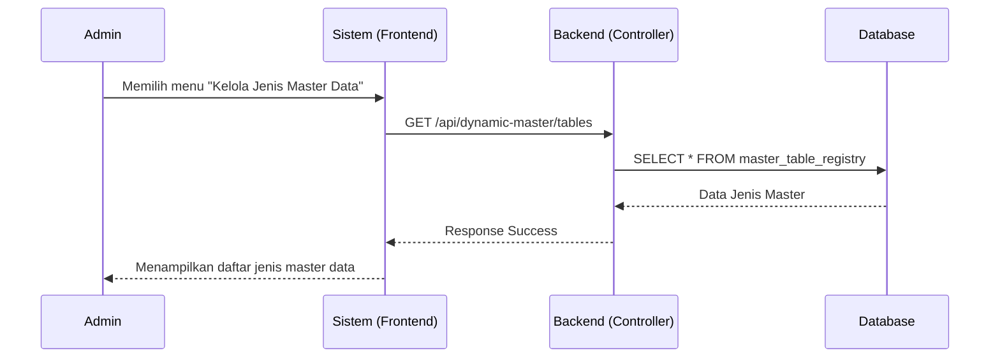
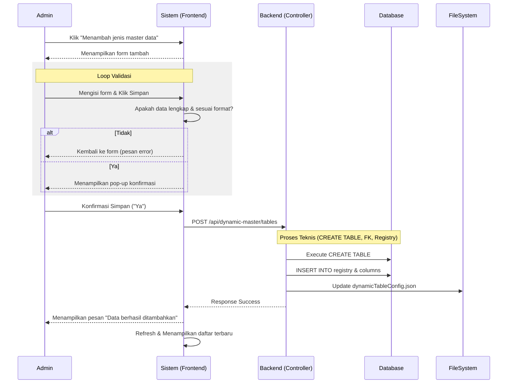
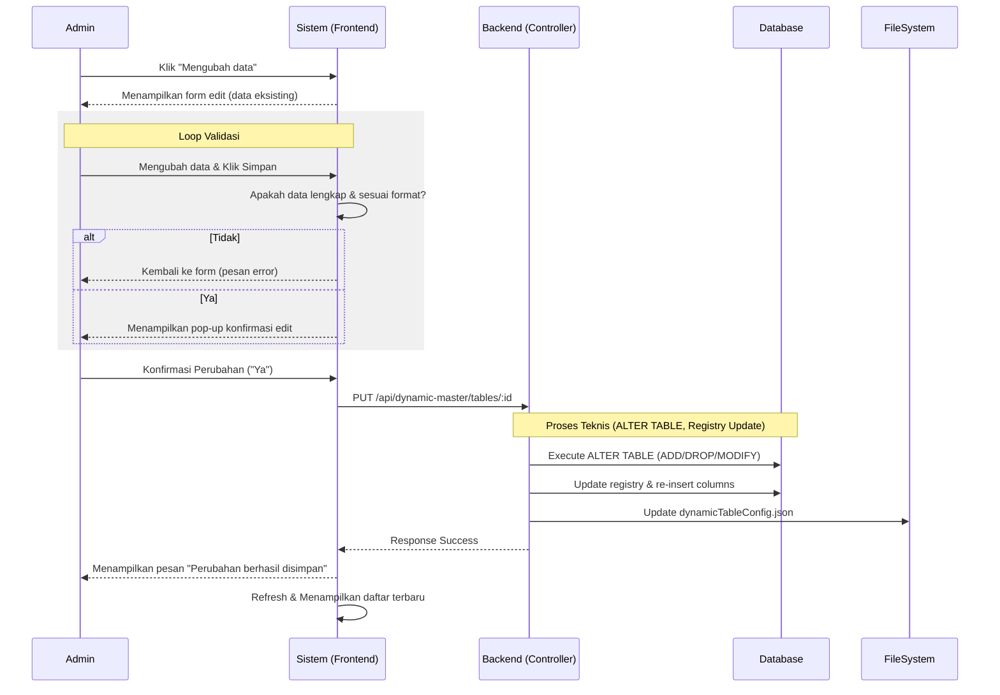
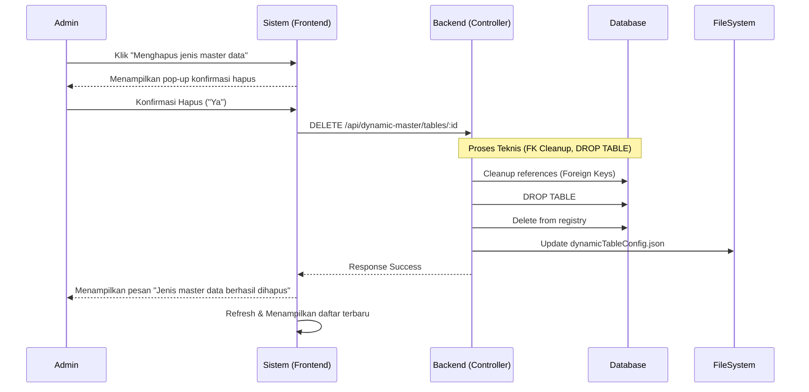

# Sequence Diagram: Kelola Jenis Master Data

Diagram ini menggambarkan alur pengelolaan jenis master data (Melihat, Menambah, Mengubah, Menghapus) sesuai dengan proses bisnis dan teknis sistem.

## 1. Melihat Jenis Master Data (Read)

Berdasarkan activity diagram:

## 2. Menambah Jenis Master Data (Create)

Berdasarkan loop validasi dan konfirmasi pada activity diagram:

## 3. Mengubah Jenis Master Data (Update)

Berdasarkan flow edit pada activity diagram:

## 4. Menghapus Jenis Master Data (Delete)

Berdasarkan flow hapus pada activity diagram:

